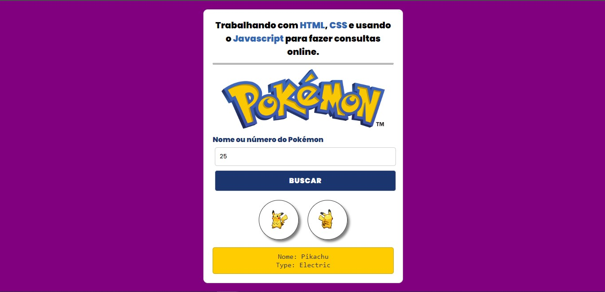
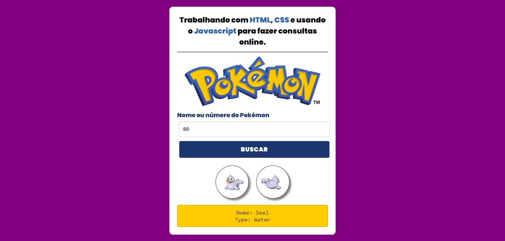
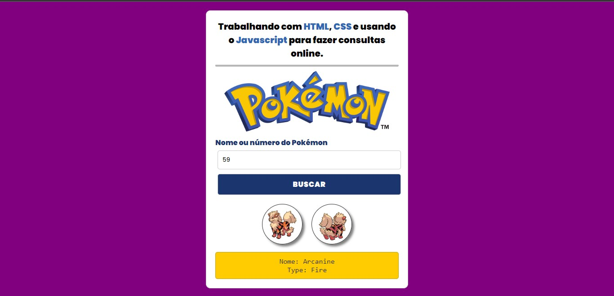

# Consumindo Uma API de Pokémon com Javascript

Projeto ministrado pelo professor Janderson Garcia que consiste em criar uma interface com HTML e CSS que sirva de estrutura para implementar a [PokeApi](https://pokeapi.co/), um serviço que possibilita buscar nomes, imagens e os tipos dos pokémons existentes.

Para fazer download das imagens necessárias usadas na estilização da página HTML, [clique aqui](https://codigodev.com.br/download/projeto-em-javascript-com-html-e-css/).

## Conteúdos abordados

Esse projeto se destina há estudantes iniciantes e aborda entre outras coisas:

* Trabalhar com formulários em HTML.

* Estrutura de um arquivo CSS, onde primeiro estilizamos as seletores mais globais, depois as tags HTML, a seguir as classes e por último eventuais ids;

* Trabalhar com a função [addEventListener()](https://developer.mozilla.org/en-US/docs/Web/API/EventTarget/addEventListener) para que o javascript "escute"os eventos que ocorrerão no botão implementado pela tag input que tem o type submit;

* Trabalhar com a função [preventDefault()](https://developer.mozilla.org/en-US/docs/Web/API/Event/preventDefault) para bloquear o refresh automático de uma página.

* Manipular partes de um pipeline de dados em HTTP com o método [fetch()](https://developer.mozilla.org/en-US/docs/Web/API/fetch), implementação da [API fetch](https://developer.mozilla.org/pt-BR/docs/Web/API/Fetch_API), uma boa forma de começar a entender o conceito de [promisses](https://developer.mozilla.org/en-US/docs/Web/JavaScript/Guide/Using_promises) do Javascript.

## Algumas Imagens do Projeto

